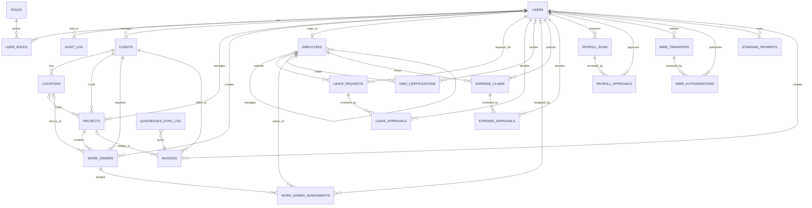

# ONYX-15 ERP Schema

## Overview

This ERD covers the initial PostgreSQL foundation for the three ERP modules requested in `ONYX-15`:

- Finance
- HR
- Operations

Security controls included in the schema:

- RLS enabled and forced on every application table in `public`
- default-deny by design: this migration creates no allow-policies yet
- `audit_log` is append-only through DB triggers
- DB-level segregation of duties for:
  - payroll preparation vs payroll approval
  - wire transfer initiation vs wire authorization

## Mermaid ERD

## Module Notes

### Finance

- `expense_claims` and `expense_approvals` track employee spend and approvals
- `payroll_runs` and `payroll_approvals` enforce preparer/approver separation
- `wire_transfers` and `wire_authorizations` enforce initiator/authorizer separation
- `standing_payments`, `invoices`, and `quickbooks_sync_log` cover recurring payments and accounting synchronization

### HR

- `employees` anchors the employee master record
- `leave_requests` and `leave_approvals` support HR review workflows
- `gwo_certifications` tracks field safety/compliance credentials

### Operations

- `clients`, `locations`, and `projects` form the commercial/project hierarchy
- `work_orders` and `work_order_assignments` support field execution planning

## Review Checklist

- Review table coverage against Appia workflows for Finance, HR, and Operations
- Confirm whether additional approval chains are needed for wire transfers beyond the enforced initiator/authorizer split
- Confirm whether `users` should remain ERP-owned with optional `auth_user_id` linkage, or be fully constrained to `auth.users`
