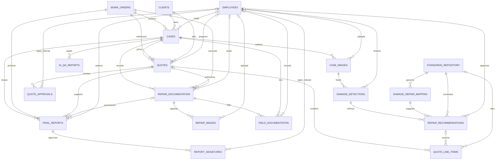

# ONYX-16 Windfix AI Schema

## Overview

This ERD covers the Windfix AI workflow foundation requested in `ONYX-16`.

The schema supports the full case path from intake through ERP archival:

1. Case intake linked to ERP work orders and clients
2. Image capture with GPS and capture timestamps
3. Damage detection
4. Standards lookup
5. Repair recommendation
6. Quote generation
7. Quote approval
8. Repair execution documentation
9. Repair image capture
10. Field documentation for materials, cure, and salt testing
11. Final reporting and signatures
12. ERP archival readiness

Security controls included in the schema:

- RLS enabled and forced on every Windfix table in `public`
- default-deny by design: this migration creates no allow-policies yet
- DB-level consistency triggers keep Windfix records aligned with ERP `work_orders` and `clients`
- image evidence tables require explicit capture timestamps and GPS-compatible fields

## Mermaid ERD

## Design Notes

- `cases` is the ERP bridge and carries the authoritative links to `work_orders`, `clients`, and operational owners in `employees`
- `quotes`, `repair_documentation`, and `final_reports` repeat selected ERP foreign keys for downstream reporting and archival, with DB triggers enforcing alignment back to `cases`
- `standards_repository` and `damage_repair_mapping` give the AI workflow a normalized standards layer instead of embedding standards logic in free text
- `quote_approvals` and `report_signatures` allow both internal employee-linked approvals and external named signers
- `field_documentation` is normalized as repeated records so cure logs, materials logs, and salt-test observations can each be stored independently

## Review Checklist

- Confirm the case status model is sufficient for the intended 12-step operational workflow
- Confirm whether quote approvals need stricter separation of duties beyond the current audit trail
- Confirm whether final report signatures should remain mixed internal or external records, or be split into separate internal and customer signature tables
